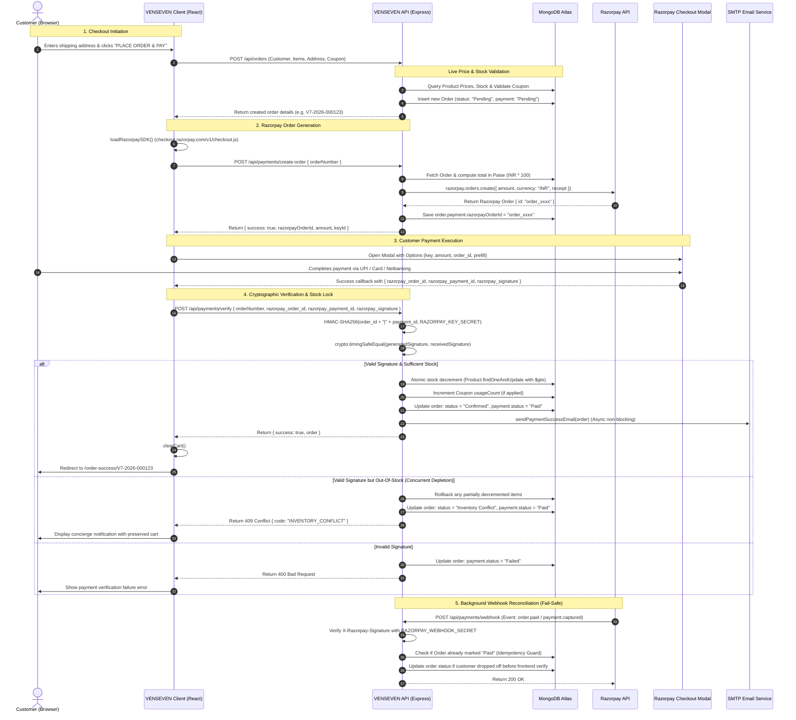

# VENSEVEN — End-to-End Razorpay Payment Integration Guide

> **Document Version:** 1.0.0  
> **Author:** VENSEVEN Engineering  
> **Target Audience:** Full-stack developers, DevOps engineers, and technical leads maintaining or deploying the VENSEVEN E-Commerce payment infrastructure.  
> **Applies To:** `client/` (React + Vite) and `server/` (Node.js + Express + MongoDB)

---

## 1. Executive Summary & Architectural Overview

The VENSEVEN e-commerce platform implements a **server-orchestrated, cryptographically verified two-step payment flow** using Razorpay. 

### Key Architectural Principles:
1. **Zero Client Trust for Pricing**: Cart totals, discounts, shipping fees, and final payable amounts are calculated and validated exclusively on the server against the live MongoDB catalog. The client never dictates the payment amount.
2. **Server-Side Order Pairing**: A Razorpay Order ID (`order_...`) is generated strictly on the server and permanently bound to a unique VENSEVEN internal order document (`V7-2026-XXXXXX`).
3. **Cryptographic Verification**: When the Razorpay Checkout popup completes on the client, the returned signature is verified on the backend using HMAC-SHA256 with `crypto.timingSafeEqual` to prevent timing attacks.
4. **Atomic Inventory Deduction with Anti-Overselling Guard**: Product sizes and stocks are atomically decremented in MongoDB using conditional queries (`$elemMatch` with `$gte: quantity`). If another customer purchases the last piece concurrently between checkout initiation and payment completion, an automatic rollback occurs and the order is transitioned to `Inventory Conflict` for priority customer concierge resolution.
5. **Idempotency & Deduplication**: Payment verification is fully idempotent. Replaying verification requests will not re-decrement inventory or duplicate transactional emails.

---

## 2. End-to-End Payment Sequence Diagram



---

## 3. Project File Reference Map

The following files in this repository govern the payment lifecycle:

| Layer | File Path | Role / Responsibility |
| :--- | :--- | :--- |
| **Server Config** | [`server/config/razorpay.js`](file:///c:/Users/AB/venseven-ecommerce/server/config/razorpay.js) | Initializes the official `Razorpay` SDK client; handles development fallback if keys are missing. |
| **Server Routes** | [`server/routes/paymentRoutes.js`](file:///c:/Users/AB/venseven-ecommerce/server/routes/paymentRoutes.js) | Defines `POST /api/payments/create-order` and `POST /api/payments/verify`. Contains HMAC cryptographic validation, atomic inventory decrement, and conflict rollback. |
| **Server Orders** | [`server/routes/orderRoutes.js`](file:///c:/Users/AB/venseven-ecommerce/server/routes/orderRoutes.js) | Validates cart items, sizes, live stock, and coupon discounts; generates internal order numbers and persists the pending order. |
| **Server Model** | [`server/models/Order.js`](file:///c:/Users/AB/venseven-ecommerce/server/models/Order.js) | Mongoose schema defining `payment` subdocument (`method`, `status`, `razorpayOrderId`, `razorpayPaymentId`, `razorpaySignature`, `paidAt`), `inventoryDeducted`, and `orderStatus`. |
| **Server Email** | [`server/utils/emailService.js`](file:///c:/Users/AB/venseven-ecommerce/server/utils/emailService.js) | Dispatches high-end HTML transactional payment confirmation receipts via Nodemailer. |
| **Server Entry** | [`server/index.js`](file:///c:/Users/AB/venseven-ecommerce/server/index.js) | Mounts `/api/payments` routes and configures CORS origin whitelist and JSON body parsing. |
| **Client Service** | [`client/src/services/paymentService.js`](file:///c:/Users/AB/venseven-ecommerce/client/src/services/paymentService.js) | Dynamically injects `checkout.js` into DOM (`loadRazorpaySDK`), calls backend creation and verification endpoints. |
| **Client Checkout** | [`client/src/pages/Checkout/Checkout.jsx`](file:///c:/Users/AB/venseven-ecommerce/client/src/pages/Checkout/Checkout.jsx) | Handles address inputs, loading states, Razorpay modal options, payment failure recovery, and success navigation. |
| **Client Retry** | [`client/src/pages/OrderSuccess/OrderSuccess.jsx`](file:///c:/Users/AB/venseven-ecommerce/client/src/pages/OrderSuccess/OrderSuccess.jsx) | Allows customers to retry payment for pending/unpaid orders directly from the success/status screen. |
| **Client History** | [`client/src/pages/Orders/Orders.jsx`](file:///c:/Users/AB/venseven-ecommerce/client/src/pages/Orders/Orders.jsx) | Allows customers to retry payment for any pending orders directly from their account order history. |

---

## 4. Backend Implementation Details

### 4.1. Razorpay Instance Configuration
Located in [`server/config/razorpay.js`](file:///c:/Users/AB/venseven-ecommerce/server/config/razorpay.js):

```javascript
const Razorpay = require("razorpay");

function getRazorpayInstance() {
  const key_id = process.env.RAZORPAY_KEY_ID;
  const key_secret = process.env.RAZORPAY_KEY_SECRET;

  if (!key_id || !key_secret) {
    console.warn("[Razorpay Warning]: Keys missing in server environment.");
    return null;
  }

  return new Razorpay({ key_id, key_secret });
}

function isRazorpayConfigured() {
  return Boolean(process.env.RAZORPAY_KEY_ID && process.env.RAZORPAY_KEY_SECRET);
}
```

### 4.2. Create Payment Order API (`POST /api/payments/create-order`)
* **Endpoint:** `POST /api/payments/create-order`
* **Access:** Public (Guest or Authenticated)
* **Request Body:**
  ```json
  {
    "orderNumber": "V7-2026-720321"
  }
  ```
* **Execution Flow:**
  1. Finds the order in MongoDB matching `orderNumber.toUpperCase()`.
  2. Rejects if order status is already `Paid`.
  3. Computes amount in **Paise** (1 INR = 100 Paise):
     ```javascript
     const amountInPaise = Math.round(Number(order.pricing.total) * 100);
     ```
  4. Calls `razorpay.orders.create()`:
     ```javascript
     const options = {
       amount: amountInPaise,
       currency: "INR",
       receipt: order.orderNumber,
       notes: {
         orderNumber: order.orderNumber,
         customerName: order.customer.name,
         customerEmail: order.customer.email,
       },
     };
     const razorpayOrder = await razorpay.orders.create(options);
     ```
  5. Updates MongoDB document:
     ```javascript
     order.payment.razorpayOrderId = razorpayOrder.id;
     order.payment.method = "RAZORPAY";
     await order.save();
     ```
  6. Returns response to client:
     ```json
     {
       "success": true,
       "razorpayOrderId": "order_xxxx1234",
       "amount": 270000,
       "currency": "INR",
       "keyId": "rzp_test_xxxx",
       "orderNumber": "V7-2026-720321",
       "customer": {
         "name": "Devendra Verma",
         "email": "devendra@venseven.com",
         "phone": "9876543210"
       }
     }
     ```

### 4.3. Cryptographic Signature Verification (`POST /api/payments/verify`)
* **Endpoint:** `POST /api/payments/verify`
* **Request Body:**
  ```json
  {
    "orderNumber": "V7-2026-720321",
    "razorpay_order_id": "order_xxxx1234",
    "razorpay_payment_id": "pay_yyyy5678",
    "razorpay_signature": "e3b0c44298fc1c149afbf4c8996fb92427ae41e4649b934ca495991b7852b855"
  }
  ```
* **HMAC SHA-256 Verification Logic:**
  Razorpay computes the signature over `${razorpay_order_id}|${razorpay_payment_id}` using `RAZORPAY_KEY_SECRET`. The backend reconstructs and verifies this with constant-time comparison:
  ```javascript
  const payload = `${razorpay_order_id}|${razorpay_payment_id}`;
  const generatedSignature = crypto
    .createHmac("sha256", process.env.RAZORPAY_KEY_SECRET)
    .update(payload)
    .digest("hex");

  const generatedBuffer = Buffer.from(generatedSignature, "utf8");
  const receivedBuffer = Buffer.from(razorpay_signature, "utf8");

  let isValidSignature = false;
  if (generatedBuffer.length === receivedBuffer.length) {
    isValidSignature = crypto.timingSafeEqual(generatedBuffer, receivedBuffer);
  }

  if (!isValidSignature) {
    order.payment.status = "Failed";
    await order.save();
    return res.status(400).json({ success: false, message: "Payment signature verification failed." });
  }
  ```

### 4.4. Atomic Inventory Decrement & Rollback Algorithm
To prevent race conditions where two customers buy the last item at the same time:
```javascript
for (const item of order.items) {
  const qty = Number(item.quantity);
  const requestedSize = String(item.size).trim().toUpperCase();

  // Atomic conditional decrement: Only decrements if stock is >= requested quantity
  const updatedProduct = await Product.findOneAndUpdate(
    {
      _id: item.productId,
      sizes: {
        $elemMatch: {
          size: requestedSize,
          stock: { $gte: qty },
        },
      },
    },
    {
      $inc: {
        "sizes.$.stock": -qty,
        totalStock: -qty,
      },
    },
    { returnDocument: "after" }
  );

  if (updatedProduct) {
    successfullyDeductedItems.push({ productId: item.productId, size: requestedSize, quantity: qty });
  } else {
    hasInventoryConflict = true;
    break;
  }
}

// If conflict occurred, rollback deducted items
if (hasInventoryConflict) {
  for (const roll of successfullyDeductedItems) {
    await Product.findOneAndUpdate(
      { _id: roll.productId, "sizes.size": roll.size },
      { $inc: { "sizes.$.stock": roll.quantity, totalStock: roll.quantity } }
    );
  }
  order.orderStatus = "Inventory Conflict";
  order.payment.status = "Paid";
  await order.save();
  return res.status(409).json({ code: "INVENTORY_CONFLICT", message: "..." });
}
```

---

## 5. Webhook Handling Architecture (Production Recommended)

> [!IMPORTANT]
> **Why Webhooks are Essential in Production:**  
> In real-world customer usage, up to 5–10% of users will close their mobile browser tab, lose 4G connectivity, or receive a phone call immediately after the bank OTP screen succeeds on Razorpay. In these scenarios, the browser's JavaScript `handler` callback never fires on the client.  
> **A Webhook is a direct server-to-server HTTP notification from Razorpay to your backend, ensuring that every paid order is confirmed even if the customer's browser crashes.**

### 5.1. Implementing the Webhook Endpoint in `server/routes/paymentRoutes.js`

Add the following webhook route to your backend:

```javascript
/**
 * @route   POST /api/payments/webhook
 * @desc    Listen for Razorpay server-to-server events (order.paid, payment.captured, payment.failed)
 * @access  Public (Protected by Razorpay Signature)
 */
router.post("/webhook", express.raw({ type: "application/json" }), async (req, res) => {
  const webhookSecret = process.env.RAZORPAY_WEBHOOK_SECRET;
  const signature = req.headers["x-razorpay-signature"];

  if (!webhookSecret) {
    console.error("[Webhook Error]: RAZORPAY_WEBHOOK_SECRET is not configured.");
    return res.status(500).json({ status: "error", message: "Webhook secret missing" });
  }

  // 1. Verify Webhook Signature
  const rawBody = typeof req.body === "string" ? req.body : req.body.toString("utf8");
  const expectedSignature = crypto
    .createHmac("sha256", webhookSecret)
    .update(rawBody)
    .digest("hex");

  const expectedBuffer = Buffer.from(expectedSignature, "utf8");
  const receivedBuffer = Buffer.from(signature || "", "utf8");

  if (
    expectedBuffer.length !== receivedBuffer.length ||
    !crypto.timingSafeEqual(expectedBuffer, receivedBuffer)
  ) {
    console.warn("[Webhook Alert]: Received webhook with invalid signature.");
    return res.status(400).json({ status: "invalid_signature" });
  }

  // 2. Parse Event Payload
  let eventPayload;
  try {
    eventPayload = JSON.parse(rawBody);
  } catch (err) {
    return res.status(400).json({ status: "malformed_json" });
  }

  const { event, payload } = eventPayload;
  console.log(`[Razorpay Webhook]: Received event "${event}"`);

  // 3. Handle Events
  try {
    if (event === "order.paid" || event === "payment.captured") {
      const paymentEntity = payload.payment?.entity;
      const razorpayOrderId = paymentEntity?.order_id;
      const razorpayPaymentId = paymentEntity?.id;

      if (!razorpayOrderId) {
        return res.status(200).json({ status: "ignored_no_order_id" });
      }

      // Find order by Razorpay Order ID
      const order = await Order.findOne({ "payment.razorpayOrderId": razorpayOrderId });
      if (!order) {
        console.warn(`[Webhook Warning]: No matching order found for Razorpay Order ${razorpayOrderId}`);
        return res.status(200).json({ status: "order_not_found" });
      }

      // Idempotency: If already paid, return 200 immediately
      if (order.payment.status === "Paid" && order.inventoryDeducted) {
        return res.status(200).json({ status: "already_processed" });
      }

      // Deduct inventory if not yet done
      if (!order.inventoryDeducted) {
        // (Execute atomic inventory deduction loop here as in /verify)
        order.inventoryDeducted = true;
      }

      order.payment.status = "Paid";
      order.payment.razorpayPaymentId = razorpayPaymentId;
      order.payment.paidAt = new Date();
      order.orderStatus = "Confirmed";
      await order.save();

      // Dispatch confirmation email if not yet sent
      if (!order.notifications?.paymentConfirmationSent) {
        await sendPaymentSuccessEmail(order, { razorpayPaymentId });
        order.notifications.paymentConfirmationSent = true;
        await order.save({ validateBeforeSave: false });
      }
    } else if (event === "payment.failed") {
      const paymentEntity = payload.payment?.entity;
      const razorpayOrderId = paymentEntity?.order_id;

      if (razorpayOrderId) {
        const order = await Order.findOne({ "payment.razorpayOrderId": razorpayOrderId });
        if (order && order.payment.status !== "Paid") {
          order.payment.status = "Failed";
          await order.save();
        }
      }
    }

    // Always respond 200 OK to Razorpay within 5 seconds to prevent retries
    return res.status(200).json({ status: "ok" });
  } catch (processErr) {
    console.error("[Webhook Processing Error]:", processErr);
    return res.status(500).json({ status: "processing_error" });
  }
});
```

---

## 6. Frontend Implementation Details

### 6.1. Loading the Checkout SDK Dynamically
Located in [`client/src/services/paymentService.js`](file:///c:/Users/AB/venseven-ecommerce/client/src/services/paymentService.js):

```javascript
export function loadRazorpaySDK() {
  return new Promise((resolve) => {
    if (window.Razorpay) {
      resolve(true);
      return;
    }

    const existingScript = document.querySelector(
      'script[src="https://checkout.razorpay.com/v1/checkout.js"]'
    );
    if (existingScript) {
      existingScript.addEventListener("load", () => resolve(true));
      existingScript.addEventListener("error", () => resolve(false));
      return;
    }

    const script = document.createElement("script");
    script.src = "https://checkout.razorpay.com/v1/checkout.js";
    script.async = true;
    script.onload = () => resolve(true);
    script.onerror = () => resolve(false);
    document.body.appendChild(script);
  });
}
```

### 6.2. Checkout Flow in [`client/src/pages/Checkout/Checkout.jsx`](file:///c:/Users/AB/venseven-ecommerce/client/src/pages/Checkout/Checkout.jsx)

```javascript
// Step 1: Create VENSEVEN order on backend
const orderResponse = await createOrder(orderPayload, token);
const createdOrder = orderResponse.order;

// Step 2: Request Razorpay Order from backend
const paymentOrderData = await createPaymentOrder(createdOrder.orderNumber);

// Step 3: Configure Razorpay Checkout Options
const razorpayOptions = {
  key: paymentOrderData.keyId || import.meta.env.VITE_RAZORPAY_KEY_ID,
  amount: paymentOrderData.amount, // in paise
  currency: "INR",
  name: "VENSEVEN",
  description: `Order ${createdOrder.orderNumber}`,
  image: "/logo.png",
  order_id: paymentOrderData.razorpayOrderId,
  prefill: {
    name: formData.fullName.trim(),
    email: formData.email.trim(),
    contact: formData.phone.trim(),
  },
  theme: {
    color: "#25b7ed", // Signature VENSEVEN cyan
    backdrop_color: "rgba(0, 0, 0, 0.88)",
  },
  handler: async function (response) {
    // Step 4: Verify cryptographic signature on backend
    setPaymentStage("verifying_payment");
    const verifyRes = await verifyPayment({
      orderNumber: createdOrder.orderNumber,
      razorpay_order_id: response.razorpay_order_id,
      razorpay_payment_id: response.razorpay_payment_id,
      razorpay_signature: response.razorpay_signature,
    });

    if (verifyRes.success) {
      clearCart();
      navigate(`/order-success/${createdOrder.orderNumber}`, {
        state: { order: verifyRes.order },
      });
    }
  },
  modal: {
    ondismiss: function () {
      setIsSubmitting(false);
      setPaymentStage("idle");
      setSubmitError("Payment was not completed. Your bag items have been preserved.");
    },
  },
};

const rzpInstance = new window.Razorpay(razorpayOptions);
rzpInstance.on("payment.failed", function (response) {
  setIsSubmitting(false);
  setPaymentStage("idle");
  setSubmitError(response.error?.description || "Payment failed.");
});
rzpInstance.open();
```

---

## 7. Order Status & Payment Lifecycle

The system moves orders through the following state transitions:

```text
[Cart / Bag]
     │
     ▼ (POST /api/orders)
[Order Created] ─── payment.status = "Pending", orderStatus = "Confirmed"
     │
     ▼ (Razorpay Modal Opens)
     ├── (Customer Cancels/Dismisses) ──► payment.status = "Pending" (Can be retried from OrderSuccess or Account)
     ├── (Card Declines/Fails)       ──► payment.status = "Failed" (Can retry)
     │
     ▼ (Payment Successful on Razorpay)
(POST /api/payments/verify OR Webhook order.paid)
     ├── Signature Verified & Stock Deducted ──► payment.status = "Paid", orderStatus = "Confirmed"
     └── Concurrent Stock Depletion          ──► payment.status = "Paid", orderStatus = "Inventory Conflict"
```

---

## 8. Security & Production Checklist

1. **Keep Secrets Out of Frontend**:
   - `RAZORPAY_KEY_SECRET` must **NEVER** be prefixed with `VITE_` or included in any client bundle.
   - Only `VITE_RAZORPAY_KEY_ID` (e.g., `rzp_live_...`) is safe on the frontend.
2. **Always Use Constant-Time Signature Comparison**:
   - Use `crypto.timingSafeEqual()` instead of `===` to prevent timing attacks.
3. **Always Recalculate Totals on the Server**:
   - Never trust `amount` sent from client requests. Fetch prices directly from MongoDB product models.
4. **Idempotent Webhooks**:
   - Always verify if `order.payment.status === 'Paid'` before executing stock deductions or sending emails.
5. **Always Acknowledge Webhooks Fast**:
   - Razorpay expects a `200 OK` response within 5 seconds. Perform intensive tasks (e.g., email sending) asynchronously.
